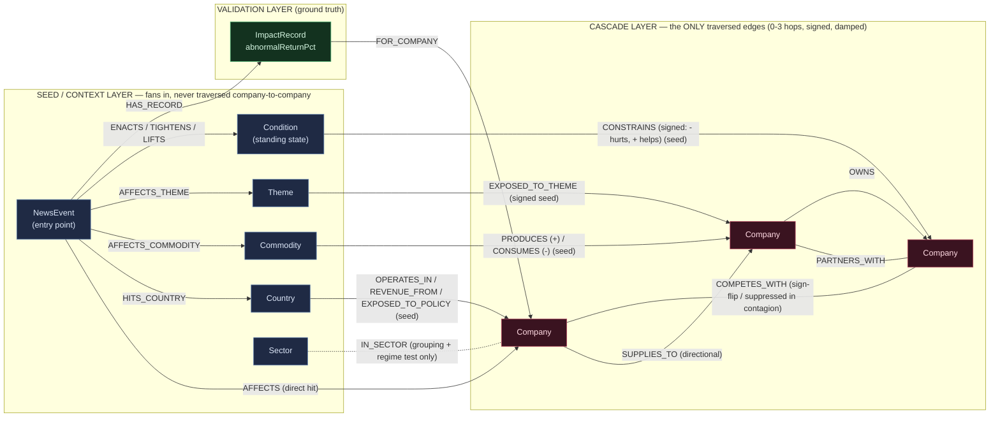

# MarketMind — Graph Schema & Data Explainer

*A reasoning-and-exposure engine for news impact, built on Neo4j. This note walks through the graph schema and the modeling choices behind it.*

---

## 0. The core design decision: a two-layer graph

MarketMind is a **two-layer graph**. Exactly **four** relationship types are ever traversed company-to-company — they form the **cascade layer**. Everything else (countries, sectors, commodities, themes, standing conditions, and all the exposure edges) is the **seed/context layer**: it *injects* shocks into companies, but is **never walked**.

This split is a deliberate modeling choice rather than an accident of the data. Here is why it matters:

> If you let a `Sector` node (or a `Country`, or a `Theme`) sit inside the traversal path, then **every** company in that sector becomes a 2-hop neighbor of every other — `(NVDA)→(:Sector {semis})→(INTC)`. The shortest path between any two same-sector names collapses to length 2, the hop-decay washes out, and the graph tells you "everything is connected to everything." The structure — the actual economic dependency that makes TSMC matter to NVDA *more* than Qualcomm does — vanishes.

So MarketMind freezes a **cascade whitelist** of four economic-dependency edges and routes all macro/contextual information in through a separate, **one-way seeding pass** that fans a shock *into* companies by their measured exposure, then hands those seeds to the structural walk. The result: reach is *earned* by structure and exposure, never by a shared group label.

---

## 1. The graph at a glance

| Thing | Count |
|---|---|
| Companies | **104** |
| Cascade edges (the 4 traversed types) | **257** |
| News events | **27** |
| Commodities | **5** (NEON, ELECTRICITY, CRUDE, LITHIUM, RARE_EARTH) |
| Themes | **7** (AI-capex, HBM-memory, AI-power-demand, export-control, China-tech, EV-transition, AI-drug-discovery) |
| Standing Conditions | **2** (US-China chip export controls; US-China Section 301 tariffs) |
| Seed-only exposure edges (macro layer) | **~201** |
| ImpactRecords (validation ground truth) | **2,565** |
| Node labels | **8** |
| Uniqueness constraints | **8** |

**8 node labels:** `Company`, `NewsEvent`, `Country`, `Sector`, `Commodity`, `Theme`, `Condition`, `ImpactRecord`.

---

## 2. Node labels and their key properties

### `Company` — the only traversed node
The economic actor. Every node that can move in price.
```
{ ticker, name, sector, country, tradable,
  priceTicker,        // yfinance symbol; null = not directly tradable (e.g. AWS, OpenAI)
  benchmark,          // local index for abnormal-return adjustment (SPY, ^N225, ^HSI, ^KS11…)
  listedFrom,         // first trade date → the event-time-validity floor (no pre-IPO "misses")
  lat, lng }          // HQ coordinates → drives the GRAPH⟷MAP flythrough in the app
```
Example: `{ticker:'SMIC', name:'Semiconductor Manufacturing International Corp', sector:'semis', country:'CN', tradable:true, priceTicker:'0981.HK', benchmark:'^HSI', listedFrom:'2004-03-18'}`.

### `NewsEvent` — the entry point (not traversed)
A dated shock. The LLM names only the **directly-hit node(s)**; the graph does the rest.
```
{ id, headline, date,          // date = the reaction trading day we grade (D-1..D+1)
  source, url, category,       // 11 categories incl. macro, geopolitical, commodity_shock, thematic…
  sign, severity,
  cv_operations, cv_demand,    // channelVector — a war ≠ a rate-hike ≠ an election in SHAPE
  cv_currency, cv_policy }
```

### `Country` — geography (seed-source only)
```
{ code (unique), name, region, bloc }   // bloc ∈ {NATO, EU, US-aligned, China-bloc, Neutral}
```
Territorial shocks (war, sanction, election) seed companies through their `OPERATES_IN` / `REVENUE_FROM` / `EXPOSED_TO_POLICY` edges. `bloc` is what lets a sanction read as "Western names down, domestic champion up."

### `Sector` — context / grouping only (seed-source, **never** a path node)
```
{ name (unique) }
```
Used for the contagion-regime test ("≥2 hit names share a sector → rivals fall together") and for the app's grouping/coloring. This is the node that *must* stay out of the traversal — see §0.

### `Commodity` — cross-border origin (seed-source only)
```
{ id (unique), name, category, geoConcentration }   // tradable=false, never price-scored
```
A neon-supply shock or a lithium crash enters here and fans into producers (**same** sign) and consumers (**opposite** sign — input-cost inversion).

### `Theme` — cross-sector basket (seed-source only)
```
{ id (unique), name, kind, description }   // kind ∈ {'narrative','style_factor'}
```
Captures co-movement no company edge expresses. The DeepSeek shock hits the **AI-capex** theme with **no direct company hit**, and the whole complex (NVDA, AVGO, MRVL, TSMC, even the power names) re-rates — purely through `EXPOSED_TO_THEME` loadings.

### `Condition` — standing state (seed-template + live state, never traversed)
```
{ id (unique), kind,           // 'sanction'|'export_control'|'tariff'|'regulation'
  status,                      // 'active'|'lifted'
  startDate, endDate,
  jurisdiction, domain, severity, description }
```
The persistent layer — a sanction lives in the graph until it's lifted. See §4.

### `ImpactRecord` — validation ground truth (never traversed)
```
{ id (unique), abnormalReturnPct,   // benchmark-adjusted realized return
  actualReturnPct, benchmark, window, filled }
```
One per (event × company), reachable via `(:NewsEvent)-[:HAS_RECORD]->(:ImpactRecord)-[:FOR_COMPANY]->(:Company)`. This is the honesty layer — the real market reaction we grade the model against. See §5.

---

## 3. The relationship taxonomy — two layers

### Layer A — the CASCADE layer (the **only** 4 types ever traversed company→company)

Pattern-matched **undirected**, **0–3 hops**, signed, damped per hop. This is the frozen whitelist.

| Type | Weight property | Range | Transmission behavior |
|---|---|---|---|
| `SUPPLIES_TO` | `criticality` | 0–1 | **Directional in transmission**: supplier→customer (`fSupDown`=0.6) propagates harder than customer→supplier (`fSupUp`=0.4), via a `startNode`/`endNode` test inside `reduce()`. |
| `PARTNERS_WITH` | `strength` | 0–1 | Symmetric, factor `fPar`=0.5. |
| `OWNS` | `pct` | 0–100 | Factor `fOwn`=0.55; weight normalized as `pct/100`. |
| `COMPETES_WITH` | `overlap` | 0–1 | **Sign-flipping** (substitution, `−fCmp`=−0.35) in normal regime; **suppressed to 0 in contagion** (rivals fall together). Stored once per unordered pair; engine walks both ways. |

Per-edge contribution: `factor × edgeWeight × hopDecay(0.6)`, accumulated along the path; paths below `minImpact`=0.03 are pruned; per-company signed contributions summed and clamped to `|impact| ≤ 1`.

### Layer B — the SEED / CONTEXT layer (fans a shock INTO companies, then is discarded — **never** walked company→company)

These edges connect a *context* node to a *company* and carry the exposure scalar that damps the seed. They are matched once, in Phase 0, and dropped before the cascade walk.

| Type | From → To | Key props | Role |
|---|---|---|---|
| `LOCATED_IN` | Company → Country | — | HQ tag + domicile-default fallback (~0.4) when no curated exposure exists. |
| `OPERATES_IN` | Company → Country | `value` (asset intensity) | Operations exposure (TSMC OPERATES_IN TW ≈ 0.92). |
| `REVENUE_FROM` | Company → Country | `value` (demand %), `sign`, `channel` | Demand + FX exposure. |
| `EXPOSED_TO_POLICY` | Company → Country | `value`, **`sign`** | Signed → can flip a seed (SMIC EXPOSED_TO_POLICY CN, **+0.6**: a winner). |
| `PRODUCES` | Company → Commodity | `value`, `sign:+1` | Producer moves **same** sign as the price. |
| `CONSUMES` | Company → Commodity | `value`, `sign:−1` | Consumer moves **opposite** (cost inversion); not suppressed by contagion. |
| `EXPOSED_TO_THEME` | Company → Theme | `value` (loading), **`sign`** | Basket membership (NVDA AI-capex loading 1.0; SMIC export-control **+1**). |
| `CONSTRAINS` | Condition → Company | `value` (severity), **`sign`** | Who a standing condition hurts (−) or helps (+). |
| `IN_SECTOR` | Company → Sector | — | Grouping + regime test only. |
| `AFFECTS` | NewsEvent → Company | `directImpact`, `sign` | The direct company hit named in the headline. |
| `HITS_COUNTRY` | NewsEvent → Country | `severity`, `sign` | A territorial event. |
| `AFFECTS_COMMODITY` / `AFFECTS_THEME` | NewsEvent → Commodity/Theme | `severity`, `sign` | A commodity/narrative shock. |
| `ENACTS` / `TIGHTENS` / `LIFTS` | NewsEvent → Condition | `severity` | An event that changes a condition's state. |
| `HAS_RECORD` / `FOR_COMPANY` | NewsEvent→ImpactRecord→Company | — | Validation wiring. |

**The rule, stated once:** a relationship is in Layer A **iff** both endpoints are `Company` and it expresses economic dependency. Everything else is Layer B. No Layer-B edge may appear inside the variable-length pattern. That single invariant is what keeps the cascade legible.

---

## 4. The standing-Condition mechanism (define once, re-price forever)

This is one of the more important modeling choices, and the source of the SMIC-green example.

A sanction or export control is modeled as a **persistent `Condition` node**, not as a property of one event. Its blast radius is authored **once** as a set of signed `CONSTRAINS` edges:

```
(cond_us_china_chip_controls)-[:CONSTRAINS {sign:-1, value:0.6}]->(NVDA)   // hurts
                              -[:CONSTRAINS {sign:-1, value:0.55}]->(ASML)  // hurts
                              -[:CONSTRAINS {sign:-1, value:0.5}]->(AMAT)   // hurts
                              -[:CONSTRAINS {sign:+1, value:0.4}]->(SMIC)   // HELPS
                              -[:CONSTRAINS {sign:+1, value:0.35}]->(HUAHONG) // HELPS
```

Now any number of news events can move this condition's state with **zero per-event re-authoring**:
- `(:NewsEvent)-[:ENACTS]->(:Condition)` or `[:TIGHTENS]` seeds every `CONSTRAINS` target with its stored sign.
- `[:LIFTS]` seeds them **sign-flipped** (a sanction being removed reverses who wins and loses).

Because the `CONSTRAINS` set is **signed**, the same shock that turns the Western semiconductor complex red automatically turns **SMIC green** — the Chinese foundry the export control protects. The graph surfaces the winner nobody named, mechanically, from the sign on a single edge. And because the Condition node *persists*, the graph holds queryable live state: "what is constraining NVIDIA right now?" is a one-line read (the `active_conditions` tool).

In short, the condition is modeled as state the graph can reason over, not just a fact it stores.

---

## 5. The ImpactRecord validation layer (grading against real returns)

MarketMind grades itself out-of-sample and **publishes the misses**. The validation layer is graph-native:

```
(:NewsEvent)-[:HAS_RECORD]->(:ImpactRecord)-[:FOR_COMPANY]->(:Company)
```

Each of the **2,565** `ImpactRecord` nodes stores the *realized* benchmark-adjusted abnormal return (`abnormalReturnPct`) for one company on one event, with its `benchmark`, `window`, and a `filled` flag. Foreign names use local-index adjustment (`^N225`, `^HSI`, `^KS11`, `^STOXX50E`), and `listedFrom` enforces event-time validity so a pre-IPO name is never scored as a "miss."

**What this layer honestly shows:**
- **Validated value = REACH.** The graph surfaces ~20% of non-headline movers that a headline-only reader sees 0% of, each with an explained path.
- **No demonstrated next-day directional edge.** Next-day *direction* lands ~47% — roughly chance, tying a whole-sector baseline — and we say so, in this document and the app's Time Machine (✓/✗ overlays, misses included).

That is the intended use: **reasoning and exposure, not prediction** — and not a buy/sell signal.

---

## 6. How to visualize it

### a) Built-in — let Neo4j draw the meta-graph
```cypher
CALL db.schema.visualization();
```
This renders every label and every relationship type as a single meta-graph. Read it as the two layers: a tight `Company`↔`Company` core (the 4 cascade types) surrounded by a ring of context nodes (`Country`, `Commodity`, `Theme`, `Condition`, `Sector`, `NewsEvent`, `ImpactRecord`) whose edges all point *into* `Company` and are never company-to-company.

### b) Curated — the mental model (paste into any Mermaid renderer)



In the diagram, every arrow from the seed layer points into the cascade box; none cross company-to-company. The four highlighted edges are the only ones a traversal follows.

---

## 7. Example Cypher reads

### a) Prove the two-layer split — the cascade core has exactly 4 edge types, nothing else
```cypher
MATCH (:Company)-[r]->(:Company)
RETURN type(r) AS cascadeEdge, count(*) AS n
ORDER BY n DESC;
// Returns ONLY SUPPLIES_TO, PARTNERS_WITH, OWNS, COMPETES_WITH (≈257 total).
// No Sector/Country/Theme edge can appear here — by design.
```

### b) Who a standing export control hurts vs **helps** (the SMIC example)
```cypher
MATCH (d:Condition {id:'cond_us_china_chip_controls'})-[c:CONSTRAINS]->(co:Company)
RETURN co.ticker AS company,
       CASE WHEN c.sign > 0 THEN 'BENEFITS ▲' ELSE 'hurt ▼' END AS effect,
       c.value AS severity, co.country AS hq
ORDER BY c.sign DESC, c.value DESC;
// Western names (NVDA, ASML, AMAT, LRCX, KLAC, 8035.T) come back hurt;
// SMIC and HUAHONG (CN) come back BENEFITS — the winner nobody named.
```

### c) Why one name is exposed — its supplier / customer / rival / owner neighborhood
```cypher
MATCH (c:Company {ticker:'NVDA'})
OPTIONAL MATCH (sup:Company)-[:SUPPLIES_TO]->(c)
OPTIONAL MATCH (c)-[:SUPPLIES_TO]->(cust:Company)
OPTIONAL MATCH (c)-[:COMPETES_WITH]-(rival:Company)
RETURN collect(DISTINCT sup.ticker)   AS supplied_by,    // TSMC, Micron, Samsung, SK hynix, Synopsys, Cadence
       collect(DISTINCT cust.ticker)  AS supplies_to,    // MSFT, AWS, GCP, Meta, Dell, SMCI
       collect(DISTINCT rival.ticker) AS competes_with;  // AMD, Intel
```

### d) The honesty layer — realized abnormal returns for an event, biggest moves first
```cypher
MATCH (:NewsEvent {id:'evt_chip_controls_tighten_2023'})
      -[:HAS_RECORD]->(ir:ImpactRecord)-[:FOR_COMPANY]->(c:Company)
WHERE ir.abnormalReturnPct IS NOT NULL
RETURN c.ticker AS ticker, ir.abnormalReturnPct AS realizedAbnormalPct, ir.benchmark AS benchmark
ORDER BY abs(ir.abnormalReturnPct) DESC
LIMIT 15;
// Realized returns, incl. NVDA -7.12% and SMIC +3.45%. Misses (e.g. AMAT/LRCX) appear here too — included, not hidden.
```

---

## 8. Notable design choices

- **The graph reasons; it doesn't only store.** Four economic-dependency edges carry a shock 0–3 hops with direction, sign, decay, and a regime switch, and every number comes with the exact path and per-hop math behind it.
- **The two-layer split has a concrete consequence.** Putting a `Sector`/`Country`/`Theme` node in the path would collapse every same-group pair to 2 hops and wash out the structure; routing macro shocks through a one-way exposure seed keeps the cascade legible.
- **Standing Conditions model a sanction as queryable, signed, persistent state** — authored once, re-priced on every event, and able to surface the beneficiary (e.g. SMIC) as well as the names that are hurt.
- **It grades itself against real returns.** 2,565 ImpactRecords of realized abnormal returns, misses shown alongside hits, and no claim to a next-day directional edge — the aim is reasoning and exposure, not prediction.

*The counts and edge behaviours above are checked against a Neo4j instance. Source of truth: `data/*.json` → `tools/gen_seed.py` → `cypher/01-marketmind-seed.cypher`; the cascade engine is `cypher/02-cascade-engine.cypher`; the Aura agent tools are `cypher/05-aura-tools.cypher`.*
